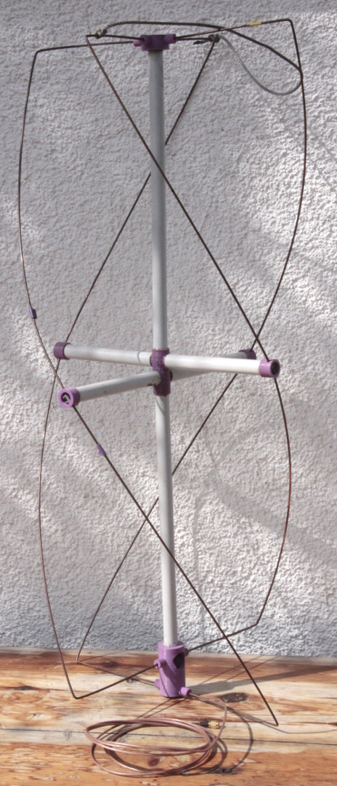
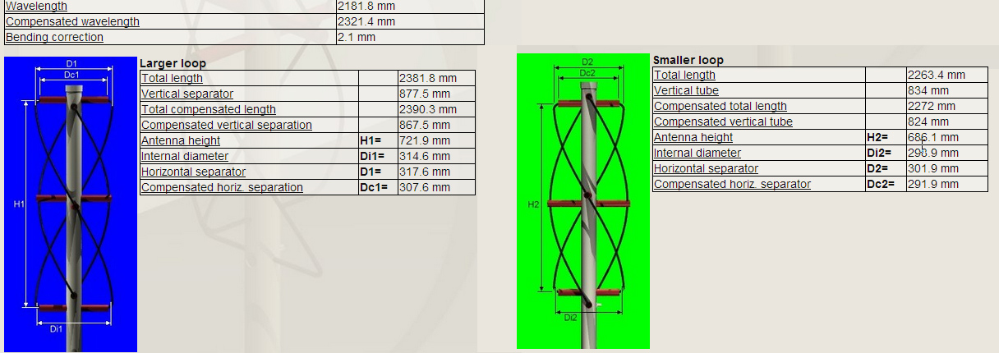
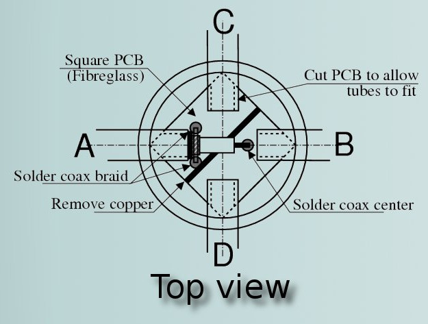

3DP-QFH
=======

3DP-QFH is a quadrifilar helicoidal antenna for 137MHz,
build out of 3D-printed connection elements, PVC-tubing and welding rod.

The dimensions have been calculated using the [calculator](https://www.jcoppens.com/ant/qfh/calc.en.php) by John Coppens.

The 3D printed parts are designed to account for all the odd distances,
allowing the PVC parts to be cut to nice full centimeter lengths.
The welding rods are copper coated steel which provides stability to the antenna,
while it is still possible to solder the coax to them.

BOM
---
* About 2m of 15mm diameter PVC-Tubing
* 5 screw terminal blocks (aka. [Lüsterklemmen](https://commons.wikimedia.org/wiki/File:Screw_terminal_with_crimped_wire.jpg))  
* A few meters of RG316 with your preferred connector at one end
* 8 WIG welding rods 3mm diameter (and longer then 50cm) or any other type of sturdy conductive wire
* Epxoy glue
* 3D printed parts

Construction
------------
1. Print the parts
	* one top part
	* one middle part
	* one bottom part
	* two cap parts (stl contains two different types, print twice)
2. Cut the PVC-tubing according to [lengths.pdf](lengths.pdf)
	* one piece 32cm
	* one piece 29cm
	* two short loop supports 13cm
	* two long loop supports 14cm
3. Glue the top part into the 32cm piece
4. Glue the bottom part into the 29cm piece
5. Mark the upper side of the middle part (same orientation as in the stl file)
6. Glue the short support tubes over the upper two arms of the middle piece
7. Glue the long support tubes over the lower two arms of the middle piece
8. Glue the middle piece between the other 2 assemble parts,
	ensure that arms for the short loop on the bottom piece (the upper two) are
	rotated 90° with respect to the support arms.
	Also make sure that the arms of the top piece line up with the support arms.
9. Plug the endcaps into the support arms, without glueing them in yet.
	Make sure to plug the larger ones into the shorter support arms.
10. Bend the welding rods. The dimensions are not too critical.
	* bend 4 pieces after 15.4cm for the long loop
	* bend 4 pieces after 14.6cm for the short loop
11. Insert the pieces and cut longer ends at the support arms.
	Make sure your helix turns counter-clockwise.
12. Use the screw terminals to connect the pieces inside the support arm caps and the bottom piece
13. Glue the support arm end caps in place
14. Feed the coax through the tubing from the bottom to the top
15. Strip the coax and solder it to the welding rods according to the following schematic.
	
	(Schematic taken from [https://www.jcoppens.com](https://www.jcoppens.com/ant/qfh/adapt.en.php))
	A and B are the connections of the long loop.
	You can use a piece of PCB or solder directly to the rods.
16. Test your new antenna
